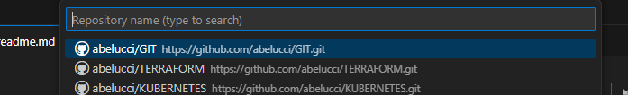
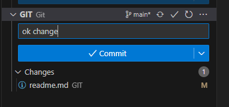
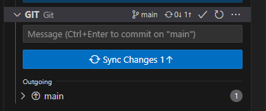

# **GIT**

Push de archivo locales hacia repo publico en github:

* Inicializar:

  ```
  git init
  ```
* Agregar repo local:

  ```
  git add .
  ```
* Lanzar commit inicial:

  ```
  git commit -m "primer readme"
  ```
* Agregar repo remoto:

  ```
  git remote add origin https://github.com/abelucci/GIT.git
  ```
* Subir todo el contenido al repo remoto:

  ```
  git push origin master
  ```

Clonar repo desde github hacia mi repo local

* Crear repo en github.
* Clonar desde VS code la repo correspondiente.

  
* Seleccionar el directorio en pc local donde se va a almacenar ese repo clonado.
* Guardar algún archivo en esta carpeta.
* Commit y push en source control hacia este repo.

 


 
